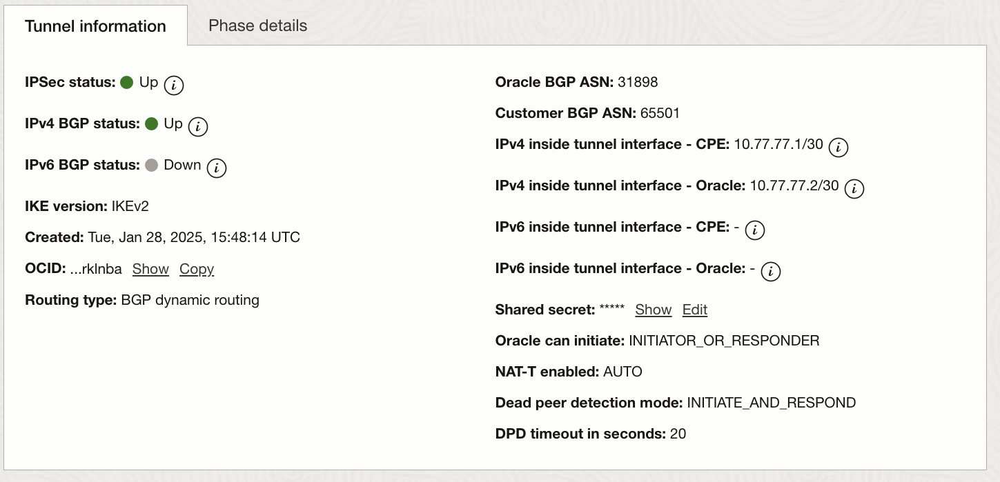

# FortiGate IPSec to DRG

## Introduction

This Document will help readers to configure Point to Point IPSec tunnels between FortiGate and OCI DRG.  While terminating IPSec between on-prem and FortiGate VM in OCI is a more common architecture, some customers choose to use their Cloud FortiGates for Outbound and East/West traffic only.  The below diagram is from the previous solution guide discussing Security Services VCN.  For more detailed information about routing confgiuration, go check it out.


Figure 1: OCI Sample Environment

## DRG Attachments

It is useful to explain how traffic will flow in this environment.  The Security Services VCN document explained how to configure the IPSec DRG Route table and export rules such that traffic coming in over the IPSec tunnel would be inspected by FortiGate.  While the same design could be used here, we have a FortiGate on-prem which can fully inspect all of that traffic prior to sending it over the IPSec into DRG.  For OCI, two tunnels are created for each remote CPE.  This provides redundancy.  You can choose whether to enable Equal Cost Multi Path (ECMP) routing as well.

### CPE configuration

In order to start the process, you must configure your CPE in OCI by navigating to **Networking > Customer connectivity > Customer-premises equipment**.  When you click "Create CPE" you will be asked for the below information:

- CPE Name
- Compartment Name
- Whether or not to enable IPSec over FastConnect (we are not doing this in our environment)
- CPE Vendor Information
- Tag information (if desired)

The resulting configuration will look something like this.


Figure 2: CPE Configuration

### Tunnel configuration

Once the CPE is configured, You can proceed to **Networking > Customer connectivity > Site-to-Site VPN** and click "Create IPSec Connection"  You will be asked for the below information:

- Connection Name
- Compartment Name
- CPE
- Whether CPE is behind a NAT device
- DRG

You will then need to provide information about the two tunnels that will be set up:

- Tunnel Name
- You can select for OCI to provide a PSK
- Routing Type (we will use BGP)
- BGP ASN of remote device
- IPv4 address of CPE tunnel interface
- IPv4 Address of Oracle Tunnel Interface
- Select whether to use IPv6 (we will not for this example)

Once the configuration is done, you will be able to see the status of the tunnels


Figure 3: IPSec Connection

You can also get details about the tunnels by clicking on them.



Figure 4: IPSec Tunnel Detail


### RPC, VC and IPSec Attachment Route Tables

Now that we have configured the IPSec connection, we willneed to configure routing information.
RPC, VC and IPSec attachments share two routing constructs by default. These are “DRG route table” and “Export route distribution”.


Figure 5: IPSec to DRG attachment

#### DRG Route Table

By default, the IPSec attachment has an auto-generated route table which is shared with the Virtual Circuit and RPC attachments. This table will import all routes known by the DRG (with their respective VCN attachments).  The result will look like below.


Figure 6: VCN Routes Imported

---

**Default Route note**: If you use a default route in this table, depending on the option chosen for Export Route Distribution, the DRG will attempt to advertise it. Caution is advised, as a misconfiguration on the remote device or service could cause unintended traffic to flow over this attachment.

---

#### Export Route Distribution

By default there is an export route distribution rule in place that matches all routes known by the DRG and accepts them. This distribution rule cannot be edited, only enabled or disabled. When enabled, the routes that are exported come from the DRG Route Table (see Figure 6 above) associated with this attachment. If you choose not to distribute routes dynamically, you will need to use static routes on the remote device or service.

The example below shows the Edit attachment popup for an IPSec attachment. Selecting “Enable dynamic export…” will cause DRG to advertise those routes via BGP.


Figure 4: Edit Attachment

## On-Prem FortiGate

This section will discuss how to configure IPSec on the FortiGate.  In our case, we are running a FortiGate FG-70F, but these configurations will be the same for all fortigate devices.

### FortiGate IPSec Configuration

Below are the Phase 1 and Phase 2 configurations used by FortiGate:

#### Phase 1

```sh
config vpn ipsec phase1-interface
    edit "OCI-1"
        set interface "wan1"
        set ike-version 2
        set peertype any
        set net-device disable
        set proposal aes256-sha384
        set dhgrp 5
        set remote-gw < OCI Tunnel 1 Public IP >
        set psksecret ENC < removed >
    next
    edit "OCI-2"
        set interface "wan1"
        set ike-version 2
        set peertype any
        set net-device disable
        set proposal aes256-sha384
        set dhgrp 5
        set remote-gw < OCI Tunnel 2 Public IP >
        set psksecret ENC < removed > 
    next
end

```

#### Phase 2

```sh

config vpn ipsec phase2-interface
    edit "OCI-1"
        set phase1name "OCI-1"
        set proposal aes128-sha1 aes256-sha1 aes128-sha256 aes256-sha256 aes128gcm aes256gcm chacha20poly1305
    next
    edit "OCI-2"
        set phase1name "OCI-2"
        set proposal aes128-sha1 aes256-sha1 aes128-sha256 aes256-sha256 aes128gcm aes256gcm chacha20poly1305
    next
end

```

#### IPSec interface configurations

```sh
config system interface
    edit "OCI-1"
        set vdom "root"
        set ip 10.77.77.1 255.255.255.255
        set type tunnel
        set remote-ip 10.77.77.2 255.255.255.252
        set snmp-index 25
        set interface "wan1"
    next
    edit "OCI-2"
        set vdom "root"
        set ip 10.77.77.5 255.255.255.255
        set type tunnel
        set remote-ip 10.77.77.6 255.255.255.252
        set snmp-index 26
        set interface "wan1"
    next 
end

```

### FortiGate BGP Configuration

Below are the configurations used for BGP.  We are re-distributing connected routes here, but FortiGate has full BGP routing capablities giving a lot of flexibility.

```sh

config router bgp
    set as 65501
    set ebgp-multipath enable
    config neighbor
        edit "10.77.77.2"
            set soft-reconfiguration enable
            set remote-as 31898
        next
        edit "10.77.77.6"
            set soft-reconfiguration enable
            set remote-as 31898
        next
    end
    config redistribute "connected"
        set status enable
    end

```

### FortiGate BGP Configuration


